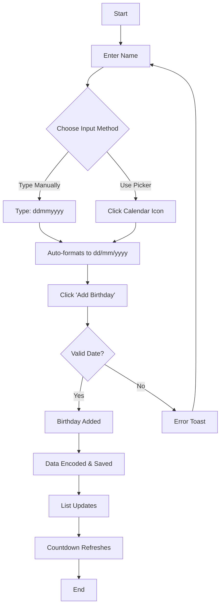
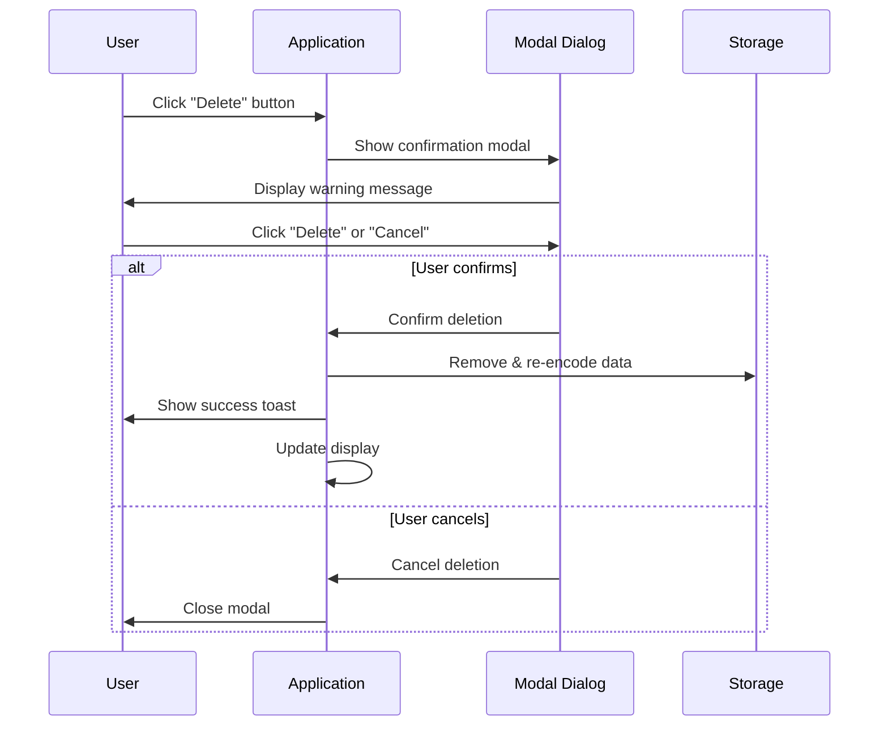
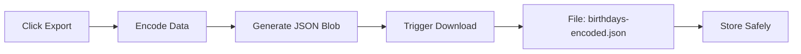
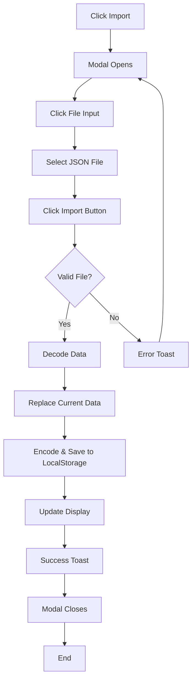
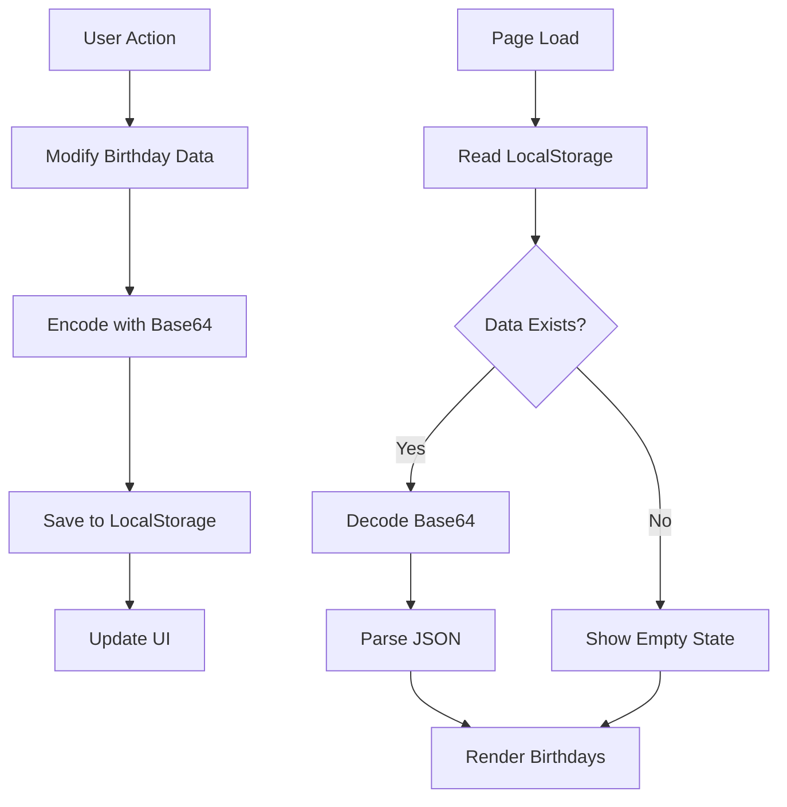
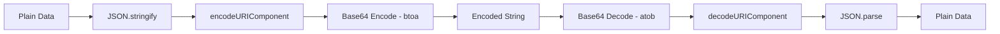

# xsukax Birthday Reminder Calendar

A lightweight, privacy-focused birthday reminder application that runs entirely in your browser. Never miss an important birthday again with automatic countdowns, encoded data protection, and zero server dependencies.

## 🎯 Project Overview

xsukax Birthday Reminder Calendar is a modern, single-page web application designed to help users track and manage birthdays efficiently. Built with vanilla JavaScript and styled with Tailwind CSS, this application prioritizes user privacy by storing all data locally with Base64 encoding. The application features an intuitive interface with automatic countdown timers, flexible date input methods, and secure data export/import capabilities.

The application is completely self-contained in a single HTML file (`index.html`), requiring no installation, backend services, or external dependencies beyond the Tailwind CSS CDN. This architecture ensures maximum portability, privacy, and ease of deployment.

## 🔒 Security and Privacy Benefits

### Local-First Architecture
- **No Server Communication**: All data remains on your device; no information is transmitted to external servers
- **Offline Capable**: Functions completely offline after initial page load
- **Zero Tracking**: No analytics, cookies, or tracking mechanisms of any kind

### Data Protection
- **Base64 Encoding**: All birthday data is encoded using Base64 encryption before storage
- **Encoded LocalStorage**: Data persisted in browser storage is automatically encoded, making it unreadable if accessed directly
- **Secure Export Format**: Exported files contain encoded data that appears as random characters to unauthorized viewers
- **No Password Required**: Seamless encoding/decoding without compromising security through password management

### Privacy Guarantees
- **Complete Data Ownership**: Users maintain full control over their data with no third-party access
- **No Cloud Dependency**: Data never leaves the user's device unless explicitly exported
- **Transparent Operation**: Open-source codebase allows full security audit and verification

## ✨ Features and Advantages

### Core Functionality
- **Intelligent Countdown Timer**: Automatically calculates and displays days until the next upcoming birthday
- **Age Calculation**: Shows the age the person will turn on their next birthday
- **Smart Sorting**: Birthdays automatically sorted by proximity to current date
- **Persistent Storage**: Data automatically saved to browser LocalStorage with encoding

### User Experience
- **Dual Input Methods**: 
  - Type dates naturally without separators (e.g., `25121990`)
  - Visual date picker for point-and-click selection
- **Auto-Formatting**: Automatic insertion of date separators while typing
- **Responsive Design**: Optimized for desktop, tablet, and mobile devices
- **Clean UI**: GitHub-inspired aesthetic with smooth transitions and hover effects

### Data Management
- **One-Click Export**: Download all birthdays as an encoded JSON file
- **Simple Import**: Upload previously exported files to restore data
- **Confirmation Modals**: Prevents accidental deletions with clear confirmation dialogs
- **Toast Notifications**: Non-intrusive feedback for all user actions

### Technical Advantages
- **Zero Dependencies**: Single HTML file with no npm packages or build steps
- **Instant Deployment**: Deploy to any static hosting service (GitHub Pages, Netlify, Vercel)
- **Cross-Browser Compatible**: Works on all modern browsers supporting LocalStorage
- **Lightweight**: Minimal resource footprint with fast load times

## 📥 Installation Instructions

### Option 1: Direct Download
1. Visit the GitHub repository: [https://github.com/xsukax/xsukax-Birthday-Reminder-Calender](https://github.com/xsukax/xsukax-Birthday-Reminder-Calender)
2. Download the `index.html` file
3. Open the file in any modern web browser
4. Begin using the application immediately

### Option 2: Clone Repository
```bash
git clone https://github.com/xsukax/xsukax-Birthday-Reminder-Calender.git
cd xsukax-Birthday-Reminder-Calender
```
Open `index.html` in your preferred web browser.

### Option 3: GitHub Pages Deployment
1. Fork the repository to your GitHub account
2. Navigate to repository Settings → Pages
3. Select the main branch as the source
4. Access your application at: `https://[your-username].github.io/xsukax-Birthday-Reminder-Calender/`

### System Requirements
- Any modern web browser (Chrome, Firefox, Safari, Edge)
- JavaScript enabled
- LocalStorage enabled (for data persistence)
- Internet connection (only for initial Tailwind CSS CDN load)

## 📖 Usage Guide

### Adding a Birthday



**Step-by-Step:**
1. Enter the person's name in the "Name" field
2. Enter the birth date using either method:
   - **Manual Entry**: Type `ddmmyyyy` (e.g., `25121990`). Slashes appear automatically
   - **Date Picker**: Click the calendar icon and select a date
3. Click "Add Birthday" button
4. The birthday appears in the list with countdown information

### Viewing Birthday Information

Each birthday entry displays:
- **Name**: The person's name
- **Date**: Birth date in dd/mm/yyyy format
- **Age**: The age they will turn on their next birthday
- **Countdown**: Days remaining until their birthday

The "Next Birthday" card at the top shows the most imminent birthday with detailed countdown.

### Deleting a Birthday



**Process:**
1. Click the "Delete" button next to any birthday
2. A confirmation modal appears asking for confirmation
3. Click "Delete" to confirm or "Cancel" to abort
4. Upon confirmation, the birthday is removed and data is re-saved

### Exporting Data



**Steps:**
1. Click the "Export" button in the header
2. The browser downloads a file named `birthdays-encoded.json`
3. Store this file securely for backup purposes
4. The file contents are encoded and unreadable without the application

**Example encoded output:**
```
W3sibmFtZSI6IkpvaG4gRG9lIiwiZGF0ZSI6IjE5OTAtMTItMjVUMDA6MDA6MDAuMDAwWiJ9XQ==
```

### Importing Data



**Process:**
1. Click the "Import" button in the header
2. A modal dialog opens
3. Click the file input field
4. Select your previously exported `birthdays-encoded.json` file
5. Click "Import" button
6. The application decodes the file and restores your birthdays
7. Current data is replaced with imported data

### Data Persistence Flow



### Date Input Formats

The application accepts dates in multiple formats:

| Input Type | Example | Result |
|------------|---------|--------|
| No separators | `25121990` | `25/12/1990` |
| Auto-formatted | `251` → `25/1` | Formats as you type |
| Date picker | Select from calendar | `25/12/1990` |
| With separators | `25/12/1990` | `25/12/1990` |

### Best Practices

1. **Regular Backups**: Export your data monthly to maintain an external backup
2. **Date Validation**: The application validates dates; invalid entries (e.g., `32/13/2020`) are rejected
3. **Browser Storage**: Keep LocalStorage enabled for automatic data persistence
4. **File Management**: Store exported files in a secure, backed-up location
5. **Cross-Device Sync**: Use export/import to transfer data between devices

## 🔧 Technical Architecture

### Application Structure
```
index.html
├── HTML Structure (Semantic markup)
├── Tailwind CSS (via CDN)
└── JavaScript
    ├── Data Management
    │   ├── Base64 Encoding/Decoding
    │   └── LocalStorage Operations
    ├── Date Processing
    │   ├── Parsing & Validation
    │   ├── Age Calculation
    │   └── Countdown Logic
    ├── UI Components
    │   ├── Modal Dialogs
    │   ├── Toast Notifications
    │   └── Dynamic Rendering
    └── Event Handlers
```

### Security Implementation


## 📄 License

This project is licensed under the GNU General Public License v3.0.

## 🤝 Contributing

Contributions are welcome! Please feel free to submit a Pull Request. For major changes, please open an issue first to discuss proposed modifications.

## 📧 Contact

For questions, suggestions, or issues, please open an issue on the [GitHub repository](https://github.com/xsukax/xsukax-Birthday-Reminder-Calender/issues).

## ⭐ Acknowledgments

- Built with [Tailwind CSS](https://tailwindcss.com/)
- Inspired by privacy-first application principles
- Designed for simplicity and user empowerment

---

**Note**: This application stores all data locally in your browser. Clearing browser data will erase stored birthdays. Always maintain external backups via the export feature.
